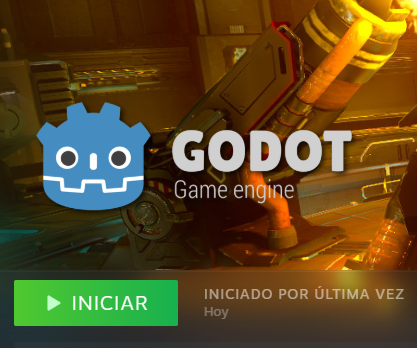
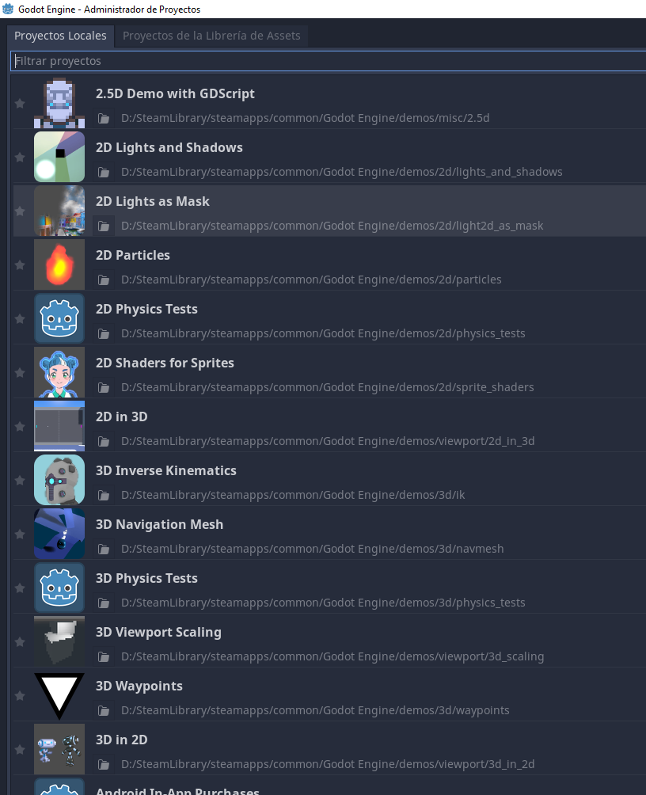

# Dodge the Creeps

Este es un juego simple donde tu personaje debe moverse y evadir a sus enemigos por el mayor tiempo posible

Esta es una versión modificada del juego propuesto en el tutorial ["Tu primer videojuego 2D"](https://docs.godotengine.org/es/stable/getting_started/first_2d_game/index.html)

## Screenshots

## Instalación
### Instalar Godot
Existen dos formas de descargar Godot:
- [Bajando la versión standard desde la página oficial](https://godotengine.org/download)
- Instalandola desde Steam (RECOMENDADA)
 - 
 - Un ventaja de instalarlo desde Steam es que viene con proyectos ejemplos preinstalados los cuales nos serán de gran utilidad
 - 
 

#### Instalar Godot desde steam
!

## Copying

`art/House In a Forest Loop.ogg` Copyright &copy; 2012 [HorrorPen](https://opengameart.org/users/horrorpen), [CC-BY 3.0: Attribution](http://creativecommons.org/licenses/by/3.0/). Source: https://opengameart.org/content/loop-house-in-a-forest

Images are from "Abstract Platformer". Created in 2016 by kenney.nl, [CC0 1.0 Universal](http://creativecommons.org/publicdomain/zero/1.0/). Source: https://www.kenney.nl/assets/abstract-platformer

Font is "Xolonium". Copyright &copy; 2011-2016 Severin Meyer <sev.ch@web.de>, with Reserved Font Name Xolonium, SIL open font license version 1.1. Details are in `fonts/LICENSE.txt`.
